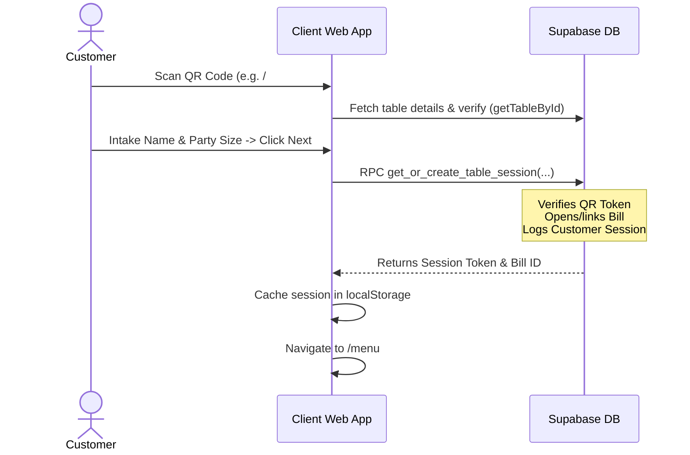

# Documentation: Secure Table QR Code & User Session Integration

This document maps out the architecture, database schemas, RPC functions, and client integrations implemented to link a secure table QR code URL to a customer session in NightOS.

---

## 1. Core Architectural Flow

When a customer scans a table QR code, the process follows these stages:



---

## 2. URL Parameter Design

Table QR codes are generated with unique table identifiers and a secure random token query parameter to prevent guessing or URL tampering:

```text
https://nightos.app/#/table/[TABLE_UUID]?token=[SECURE_VERIFICATION_TOKEN]
```

---

## 3. Database Schema Modifications

To support session integration, execute the following SQL schema statements:

```sql
-- 1. Create customer_sessions table mapping active visitors to active bills
CREATE TABLE IF NOT EXISTS public.customer_sessions (
    id uuid NOT NULL DEFAULT gen_random_uuid(),
    venue_id uuid NOT NULL REFERENCES public.venues(id) ON DELETE CASCADE,
    table_id uuid NOT NULL REFERENCES public.tables(id) ON DELETE CASCADE,
    bill_id uuid REFERENCES public.bills(id) ON DELETE CASCADE,
    guest_name text NOT NULL,
    party_size integer NOT NULL DEFAULT 1,
    session_token text NOT NULL UNIQUE DEFAULT gen_random_uuid()::text,
    status text NOT NULL DEFAULT 'active' CHECK (status IN ('active', 'closed')),
    created_at timestamptz NOT NULL DEFAULT now(),
    last_active_at timestamptz NOT NULL DEFAULT now(),
    CONSTRAINT customer_sessions_pkey PRIMARY KEY (id)
);

-- Enable RLS and define management policy
ALTER TABLE public.customer_sessions ENABLE ROW LEVEL SECURITY;
CREATE POLICY "Public can manage own session" ON public.customer_sessions FOR ALL USING (true) WITH CHECK (true);

-- 2. Add qr_code_token to public.tables
ALTER TABLE public.tables ADD COLUMN qr_code_token text UNIQUE DEFAULT gen_random_uuid()::text;

-- 3. Add customer_session_id and guest_name to order_submissions (for server-side tracking)
ALTER TABLE public.order_submissions ADD COLUMN customer_session_id uuid REFERENCES public.customer_sessions(id) ON DELETE SET NULL;
ALTER TABLE public.order_submissions ADD COLUMN guest_name text;

-- 4. Add customer_session_id and guest_name to order_items (for individual item split checks)
ALTER TABLE public.order_items ADD COLUMN customer_session_id uuid REFERENCES public.customer_sessions(id) ON DELETE SET NULL;
ALTER TABLE public.order_items ADD COLUMN guest_name text;
```

---

## 4. Session Initialization RPC Function

The function `public.get_or_create_table_session` validates parameters, links table bills, registers guest details, and returns active credentials. 

> [!IMPORTANT]
> The function uses `#variable_conflict use_column` to prevent naming collisions between database columns and return table parameters (such as `venue_id`).

```sql
CREATE OR REPLACE FUNCTION public.get_or_create_table_session(
    p_venue_slug text,
    p_table_id uuid,
    p_token text,
    p_guest_name text,
    p_party_size integer
)
RETURNS TABLE (
    session_id uuid,
    session_token text,
    bill_id uuid,
    venue_id uuid,
    payment_model text,
    table_label text
) AS $$
#variable_conflict use_column
DECLARE
    v_venue_id uuid;
    v_payment_model text;
    v_table_label text;
    v_qr_token text;
    v_bill_id uuid;
    v_session_id uuid;
    v_session_token text;
BEGIN
    -- 1. Get and validate table/venue details
    SELECT t.venue_id, v.payment_model, t.table_label, t.qr_code_token
    INTO v_venue_id, v_payment_model, v_table_label, v_qr_token
    FROM public.tables t
    JOIN public.venues v ON t.venue_id = v.id
    WHERE t.id = p_table_id AND v.slug = p_venue_slug AND t.is_active = true AND v.is_active = true;

    IF v_venue_id IS NULL THEN
        RAISE EXCEPTION 'Table not found or venue is inactive';
    END IF;

    -- 2. Verify table verification token (defends against NULL tokens)
    IF v_qr_token IS NULL OR v_qr_token != p_token THEN
        RAISE EXCEPTION 'Invalid table verification token';
    END IF;

    -- 3. Get or create active bill for this table session
    SELECT id INTO v_bill_id
    FROM public.bills
    WHERE table_id = p_table_id AND status = 'open' AND venue_id = v_venue_id
    ORDER BY created_at DESC
    LIMIT 1;

    IF v_bill_id IS NULL THEN
        INSERT INTO public.bills (venue_id, table_id, status, payment_model, guest_count)
        VALUES (v_venue_id, p_table_id, 'open', v_payment_model, p_party_size)
        RETURNING id INTO v_bill_id;
    ELSE
        -- Update guest count aggregate if joining an existing bill
        UPDATE public.bills
        SET guest_count = guest_count + p_party_size
        WHERE id = v_bill_id;
    END IF;

    -- 4. Create customer session
    INSERT INTO public.customer_sessions (venue_id, table_id, bill_id, guest_name, party_size)
    VALUES (v_venue_id, p_table_id, v_bill_id, COALESCE(p_guest_name, 'User'), p_party_size)
    RETURNING id, customer_sessions.session_token INTO v_session_id, v_session_token;

    RETURN QUERY SELECT v_session_id, v_session_token, v_bill_id, v_venue_id, v_payment_model, v_table_label;
END;
$$ LANGUAGE plpgsql SECURITY DEFINER;
```

---

## 5. Client State Persistence (`localStorage`)

Upon successful RPC execution, the client app caches the active session configuration:

* **Storage Key**: `nightos:session`
* **JSON Structure**:
  ```json
  {
    "sessionId": "UUID of the customer_sessions record",
    "sessionToken": "Secure session validation token",
    "billId": "UUID of the active open bill for the table",
    "venueId": "UUID of the venue",
    "tableId": "UUID of the table scanned",
    "tableLabel": "e.g. Table 04",
    "guestName": "e.g. Ama",
    "partySize": 4
  }
  ```

This state is queried on subsequent page loads to guard client routes and automatically label orders sent to the kitchen.
